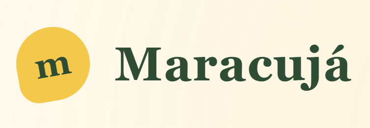
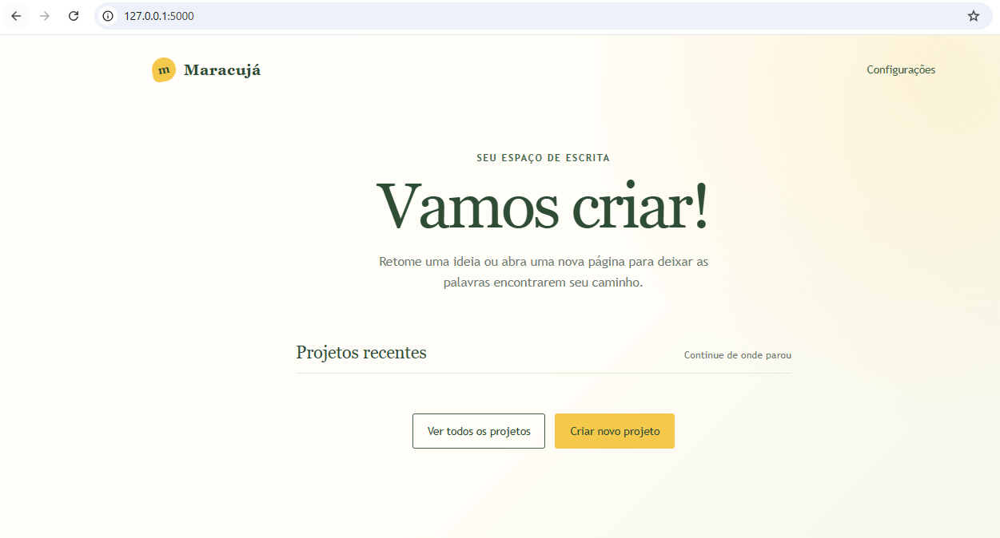

# maracuja-editor

[](https://github.com/joaopedrolourencoaffonso/maracuja-editor/releases)



Um ambiente de escrita focado no armazenamento local para autores, que guarda projetos, capítulos, notas e revisões, permitindo também a exportação para formatos abertos.

Powered by:

- [FPDF2](https://github.com/py-pdf/fpdf2)
- [Flask](https://github.com/pallets/flask)
- [quilljs](https://github.com/slab/quill/).

## Features Atuais

- edição e gerenciamento de projetos: Crie seus livros, adicione uma capa, organize os capítulos, tudo num só lugar!
- versionamento de capítulos: Acha que um capítulo podia estar melhor, mas não quer mexer no texto? Crie uma nova versão! E se gostar [canonize](#o-que-é-canonização)!
- notas: adicione notas sobre personagens, worldbuilding, temas, arcos de história e tudo mais que você quiser!
- compare versões: está em dúvida em qual versão do capítulo você gostou mais? Compare-as e edite-as lado a lado em tempo real!
- exporte: Exporte seu projeto para pdf, html e markdown (epub e docx chegando em breve!)
- armazenamento local: tudo armazenado localmente, sem nuvem, assinatura ou custos adicionais!

## Como Instalar?

1. Faça o clone do projeto

```
git clone https://github.com/joaopedrolourencoaffonso/maracuja-editor.git
```

2. Acesse o diretório:

```
cd maracuja-editor
```

3. Instale as dependências

```
pip install -r requirements.txt
```

4. Inicie o aplicativo:

```
python .\app.py
```
Ou no linux

```
python ./app.py
```

Agora acesse http://127.0.0.1:5000/ e você verá uma página similar ao abaixo:




## Como usar?

Para ver um tutorial simples de como usar o projeto, veja [esse tutorial](./tutorial.md).

## O que é canonização?

Do inglês, "canon", geralmente usado para simbolizar aspectos imutáveis de uma certa história (a morte do tio Ben do homem aranha, por exemplo).

A ideia é que quando um capítulo é "canonizado", ele é marcado como a versão 'oficial' ou no mínimo 'atual' do capítulo em questão, sendo o capítulo exposto por padrão quando se acessa o link pela página do projeto, assim como o capítulo que será adicionado ao texto em caso de exportação do projeto para html, markdown e pdf.

## Limitações

Ainda há bugs na função para exportar do formato json do quill para os demais formatos e como resultado, algumas formatações estão sendo perdidas, mas, para casos gerais, funciona

Do mesmo modo, ainda não é possível configurar a aparência do pdf final e figuras ainda não são incluídas. Essas features serão adicionadas em versões futuras.

## Público-alvo

Atualmente, o projeto ainda é focado em usuários com alguma experiência ou conforto com TI e informática, uma vez que ainda carece de instalador ou executável.

Em caso de problemas, por favor, abra uma [issue](https://github.com/joaopedrolourencoaffonso/maracuja-editor/issues) o quanto antes. O projeto é mantido por uma única pessoa em seu tempo livre, portanto o atendimento pode não ser imediato, mas todo relato será analisado.

Pull requests são bem vindos!

## Próximos Objetivos

### v2.0.0 - revisão de código

- Revisar código, deixar mais limpo, eficiente e organizado
- Corrigir problema de importar backup

### v3.0.0 - Exportar para PDF

- revisar bugs da exportação para PDF
- permitir customização da função de exportar html
- permitir customização da função de exportar PDF

### v4.0.0 - Imagens

- Suportar figuras nos projetos

### v5.0.0 - Documentos

- Documentos únicos (editar sem associar a projetos)

### v6.0.0 - Pequenas melhorias

- Adicionar dark mode.
- Contador de linhas
- Contador de palavras

### v7.0.0 - Exportação

- Exportar para docx
- Exportar para epub
- Outros formatos?

### v8.0.0 - Instalador e Desktop

- Converter em um projeto desktop
- Criar instalador para facilitar para usuários leigos.

### v9.0.0 - Outras Línguas

- English
- Español

## Discussões abertas

[How to convert Delta JSON to Markdown using server-side Python](https://github.com/slab/quill/discussions/4828)